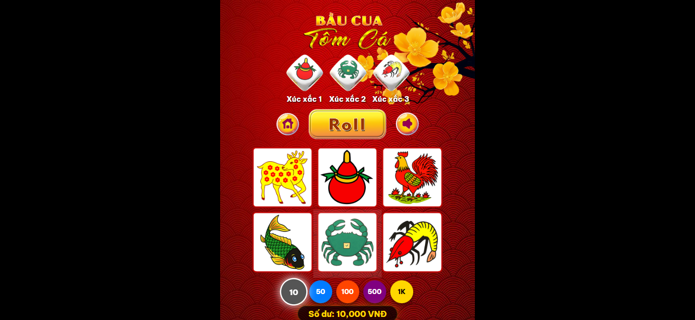

# 🎲 Bầu Cua Tôm Cá - Phiên bản Web (.NET 9 & SignalR)



Trò chơi Bầu Cua Tôm Cá truyền thống được tái hiện trên nền tảng Web với công nghệ SignalR cho trải nghiệm thời gian thực mượt mà.

### 🔗 Link Demo
- [https://baucau-locdev.vercel.app](https://baucau-locdev.vercel.app)


## 🎯 Tính năng
- ✅ Giao diện 100% bản gốc, tái tạo chuẩn xác bằng HTML5/CSS3.
- ✅ Lắc xúc xắc thời gian thực .
- ✅ Hệ thống đặt cược trực quan với các đồng Chip casino.
- ✅ Âm thanh chân thực: tiếng lắc xúc xắc, nhạc nền Tết, âm báo thắng/thua.
- ✅ Quản lý số dư và tính toán tiền thắng tự động từ Server.
- ✅ Kết nối ổn định qua WebSocket (SignalR).

## 🏗️ Kiến trúc dự án
Dự án được xây dựng theo mô hình Client-Server:
- **Backend (BauCua.Server)**: ASP.NET Core 9.0 mạnh mẽ, xử lý logic game và đồng bộ hóa trạng thái qua SignalR Hub.
- **Frontend (BauCua.Client)**: Vanilla JavaScript, HTML5 và CSS3 với thiết kế Responsive (tương thích cả điện thoại và máy tính).

## 🚀 Hướng dẫn khởi chạy

### Yêu cầu hệ thống
- .NET SDK 9.0 trở lên.
- Trình duyệt web (Chrome, Edge, Firefox).

### Các bước thực hiện
1. **Khởi chạy Server**:
   ```bash
   cd src/BauCua.Server
   dotnet run
   ```
   Server sẽ mặc định chạy tại: `http://localhost:5000` (hoặc cổng được cấu hình).

2. **Truy cập Client**:
   Mở file `src/BauCua.Client/wwwroot/index.html` bằng trình duyệt hoặc dùng Live Server (VS Code).

## 📦 Cấu trúc thư mục
```
baucua/
├── src/
│   ├── BauCua.Server/     # Source code Backend (C#)
│   │   ├── Controllers/   # API điều khiển
│   │   ├── Game/          # Logic game chính & SignalR Hub
│   │   └── Program.cs     # Cấu hình khởi tạo server
│   └── BauCua.Client/     # Source code Frontend
│       └── wwwroot/
│           ├── assets/    # Hình ảnh và âm thanh của game
│           ├── css/       # Định dạng giao diện (style.css)
│           ├── js/        # Xử lý logic phía client (game.js)
│           └── index.html # Giao diện chính người dùng
├── tests/                 # Các bài kiểm tra logic
└── docs/                  # Tài liệu hướng dẫn chi tiết
```

## 🎮 Cách chơi
1. **Chọn Chip**: Chọn mệnh giá tiền bạn muốn đặt (10, 50, 100...).
2. **Đặt cược**: Nhấn trực tiếp vào các hình linh vật (Nai, Bầu, Gà, Cá, Cua, Tôm) trên bàn.
3. **Lắc xúc xắc**: Nhấn nút **Roll** để bắt đầu quay.
4. **Nhận kết quả**: Xem kết quả và số dư mới nhận được.


